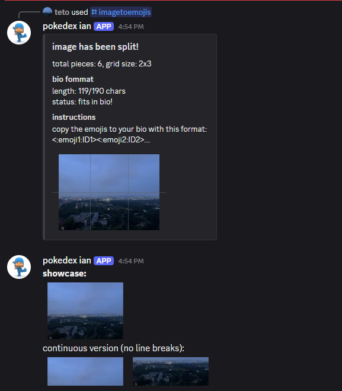

This discord bot is an easy to use, all rounder for all of your image to emoji needs.
# Features
- Uses Pycord for the bot
- Turns images into a grid suitable for emojis
- Automatically create emojis to copy and paste
## Installing
**Python 3.6 or higher is required**

To install the bot, do the following:
```bash
    $ git clone https://github.com/yeknam-and-co/discord-emoji-bot.git
    $ cd imagegen
    $ python3 -m pip install -r requirements.txt
    $ python3 main.py
```

## Commands
- /imagetoemojis [image: attachment] [size: 64 recommended] [bio_mode: bool] - Transforms image provided into emojis automatically uploaded onto the server
- /nukeemojis - Nuke all emojis on server, only created since emoji limits suck.

## Examples



### cya
Have fun using the bot!
   -ian t

